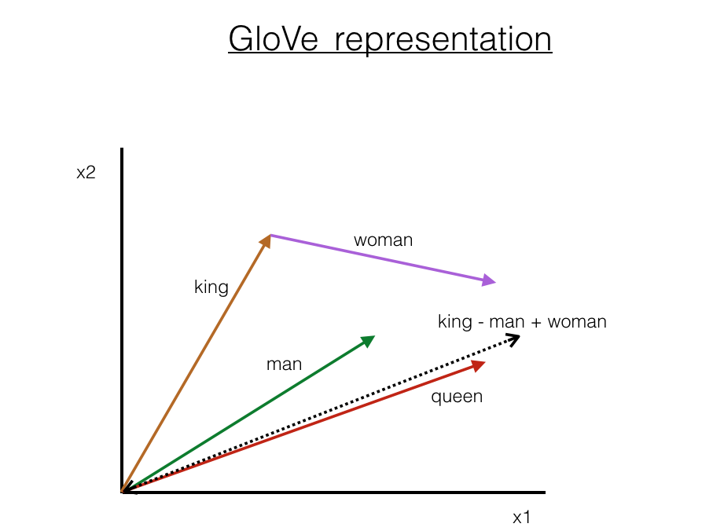
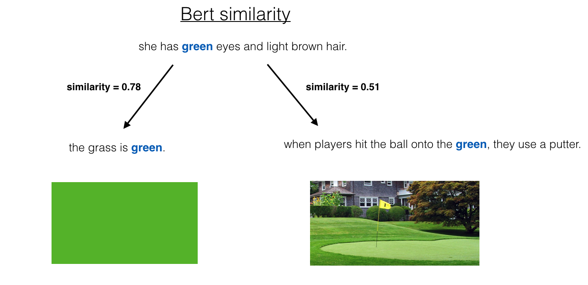
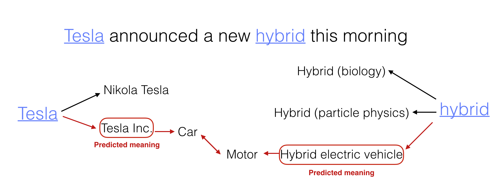
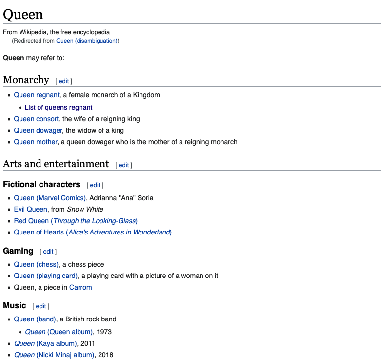
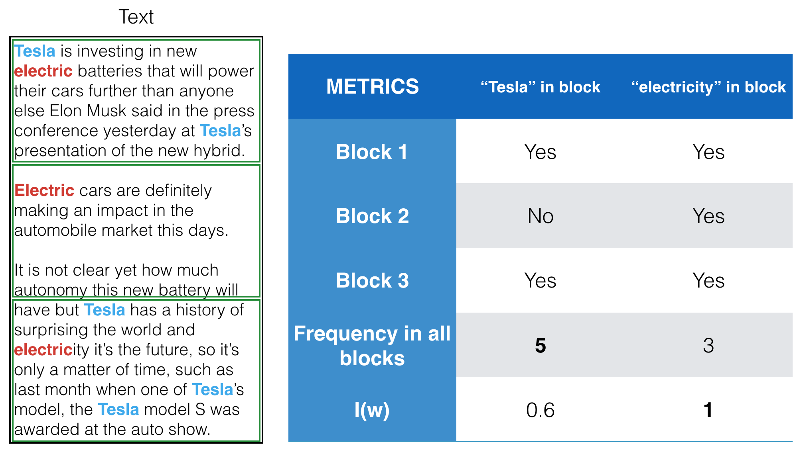
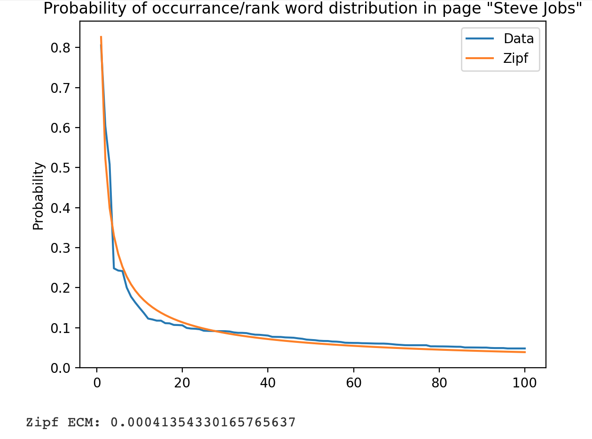
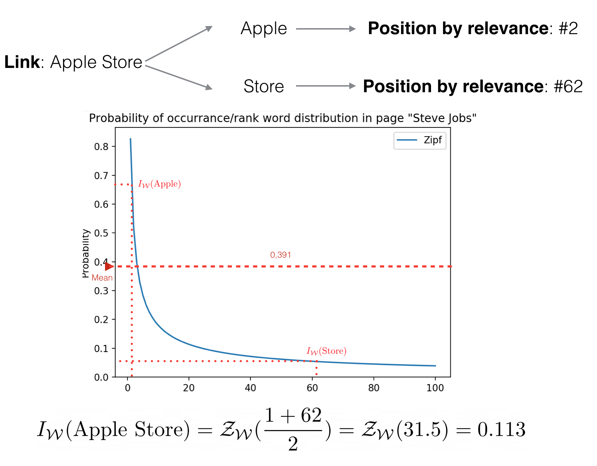

## What is this project?
This project contains the implementation in Python of the Contextual Forest, an unsupervised model for language disambiguation that I developed during [my bachelor's thesis](http://t.ly/bBNd). It includes a demo notebook with
code snippets showing the main functionality and informally exposes the ideas behind the model as well as 
the key points discussed in my bachelor's thesis regarding the task of Word Sense Disambiguation (WSD).

## Introduction

Contextual Forests, as many other language models, operate under the assumption that the meaning of a word in a sentence can
be fully determined by it's context (i.e. the other words in the sentence). This seems like
a very reasonable thing to assume considering that this is essentially what humans do when we communicate with each other.

Unfortunately, in many situations context has proven to be rather difficult to figure out using even the most advanced techniques. 
This is a direct consequence of the knowledge-based component in context, let's illustrate this with an example.

Suppose we are given the folowing sentence:


_"The best Queen songs redefined rock"_


Now let's focus our attention in the words _Queen_ and _rock_. For us humans, if familiar with 70's rock, it's an incredibly easy and almost automatic process to recognise that we are talking about the british rock band _Queen_ and that _rock_ is a music genre. For a language model instead, this could present
a far more challenging situation since both _Queen_ and _rock_ as separate words can be referring to a considerable number of different things (for example a female monarch and a solid aggregate of minerals). 

So how do language models deal with this problem? One of the key points
is that this words appear <u>together</u> in the same sentence. Probabilistically speaking, in the example sentence I could be talking about the 
Queen Elizabeth II of the United Kingdom but it's highly unlikely since I'm also talking about some concept 
represented by the word _rock_ which has not been statistically associated with the context of Queen Elizabeth II. 
From this point it's only natural to wonder how a language model assigns this probabilities and where do the statistics come from. 
Depending on the answer to this question we can roughly classify language models in two types:

* **Context-free models** such as [Word2Vec](https://arxiv.org/pdf/1301.3781.pdf) or [GloVe](https://nlp.stanford.edu/pubs/glove.pdf), are based on creating a 1:1 mapping between words and vectors (which are usually referred to as word embeddings). Although specifics in the implementation may be different, the general idea for this models consists in training a neural network over a large corpus of text to get a representation that captures semantic properties. For example if we consider the vectors $k, w, m$ corresponding to the words "king", "woman" and "man" respectively, then the vector $q = (k - m) + w$ it's very close to the one assigned to the word "queen". This can be extremely useful in many situations but it's rather complicated to solve the WSD problem with this kind of models since the embedding for every word is unique and independent from the context.

    <figure>
    
    <figcaption align="center"> GloVe embeddings representation </figcaption>
    </figure>

* **Dynamic-embedding models** like [ELMo](https://arxiv.org/pdf/1802.05365.pdf), [BERT](https://arxiv.org/pdf/1810.04805.pdf) and [RoBERTa](https://arxiv.org/pdf/1907.11692.pdf) are based on an architecture call "transformers" and since their first appearance arround 2018, they have been at the top of the NLP world. The difference between this models and the context-free ones is that in this kind of models the embedding of a word is actually assigned **depending** on the other words in the context. They also need a huge corpus for training and considerably more computational power than the context-free models but the results in the WSD problem are significantly better.

    <figure>
    <center></center>
    <figcaption> Similarity comparison for RoBERTa embeddings  </figcaption>
    </figure>

Although dynamic-embedding models have a significantly better performance in the WSD problem, there is a key aspect in the training process that they share with the context-free models; they both need a big text corpus. Having this big corpus for training means that with enough computational power and some fancy architectures one can build a pretty decent model entirely based on statistics infered from the corpus (like training masked language models or predicting the next word like the GPT family) with no real understanding of the concepts that language represents. 

So what are we looking at when we are face to face with the state of the art models? Language understanding or statistical inference? The answer is somewhere in between, it's clear that language models have mastered the syntax of language but they have a long way to go to be able to understand the subtilities of language (see [this article](https://aclanthology.org/P19-1459.pdf) from Niven and Kao for an example).


While I was thinking about how people solve the WSD problem on a daily basis in conversations, I came to the conclusion that the disambiguation could not be a memory-based process. In the previous example, we don't know that _Queen_ is a british rock band because one night while we were discussing music in a bar we heard a friend of a friend using the words _Queen_ and _rock_ in the same sentence. We know that _Queen_ is a british rock band and _rock_ is a music genre because the context of each word is, from all the possibilities and probabilistically speaking, the most consistent option considering the rest of the words in the sentence. Specifically, when we read the first three words (_The best Queen_) and until the next word, in our head, Queen can mean many things, but the moment we read the word _songs_ we think "Okay we are talking about music so this _Queen_ must be the rock band". This kind of association is exactly the idea behind Contextual Forests.

## Contextual Forest

So I wanted to built a disambiguation system through semantical connections using the possible context of the words in a sentence. I thought that using context for making connections to find common ground between word meanings sounded a lot like spanning nodes in searching algorithms over graphs so I decided to model this disambiguation process as different Trees (one for each possible meaning) trying to connect with each other. Given a word, to make the model work I needed some kind of context about possible meanings organized in a structure similar to a graph so I decided to use Wikipedia. Unfortunatly, Wikipedia only provides articles about nouns (objects / people / events ...) so due to this impass and time restrictions the implemented version of Contextual Forests only works for disambiguating nouns. Nevertheless, the process is easily scalable if one finds another resource for covering more words.

<figure>
<center></center>
<figcaption> An example with a sentence about Tesla of the idea behind the model</figcaption>
</figure>

### Step by step
 
 The first step is identifying nouns in a sentence and finding all possible meanings for every one. This could have been a problem but forunatly Wikipedia has pages specifically designed for this task:

<figure>
<center></center>
<figcaption> Wikipedia disambiguation page for Queen</figcaption>
</figure>


After finding possible meanings, it's worth mentioning that a Wikipedia page has a rather large number of links that recursively expanded can yield to a computationally infeasable search problem. For this reason, the next thing the algorithm needed was a "relevance function" that could evaluate which links to expand in order to quickly find a connection between Trees (this is commonly known in computer science as a heuristic function). This heuristic function needed to represent how close two Wikipedia articles are. At first, I thought in just finding common links between articles, but as it turns out, it's not uncommon for two Wikipedia pages that are not related at all to have a few common links:

```python
    >>> from ContextualForest import wiki
    >>> A = wiki.page('potato').links.keys()
    >>> B = wiki.page('Microsoft').links.keys()
    >>> len(A & B)
    12
```

What would eventually end up working was using the *relevant links* and this was a crucial step. 

So how do we define a relevant link? For figuring that out, we need to define what words are relevant in a Wikipedia page. I identified relevant words with the ones uniformly distributed over the text (note that this relevant words don't need to be repeated many times but just a few times every once in a while). 

<figure>
<center></center>
<figcaption>Frequency count vs uniformly distributed words</figcaption>
</figure>

After that I tried to define link relevance as the average relevance of the words composing the link's title. This prooved to be innefective as a relevance metric because using a non-weighted average can be pretty sensitive to outliers resulting in a bias towards links that have the most relevant word as part of the title. To solve this issue I studied the distribution of the relevance score which I realised could be approximated by Zipf's distribution.

<figure>
<center></center>
<figcaption>Fitting a Zipf distribution to the relevance of the words in Steve Jobs Wikipedia page</figcaption>
</figure>

Instead of computing link relevance as a simple average, I defined it as the inverse image of an average over rank positions capturing the decreasing factor on the scoring values to correct the bias.

<figure>
<center></center>
<figcaption>Example of link relevance ("Apple Store" in Steve Jobs Wikipedia page) </figcaption>
</figure>
At this point, using the Trees we have all the necessary tools to disambiguate context with this non-supervised technique

```python
    >>> from ContextualForest import contextual_forest
    >>> fr = fr = contextual_forest("Queen redefined rock with their songs")
    >>> for word, node in fr.dic.items():
            possible_meanings = len(disambiguation(word))
            if not possible_meanings:
                #no disambiguation page
                possible_meanings = 1
            print(f"Word: {word}\t possible meanings: {possible_meanings}\n Choosen: {node.page.text[:100]} ...")
    
    Word: rock	 possible meanings: 49
    Choosen: Rock music is a broad genre of popular music that originated as "rock and roll" in the United States ...
    Word: songs	 possible meanings: 1
    Choosen: A song is a musical composition intended to be performed by the human voice. This is often done at d ...
    Word: queen	 possible meanings: 40
    Choosen: Queen are a British rock band formed in London in 1970. Their classic line-up was Freddie Mercury (l ...
    
```

Note that the algortihm is far from perfect and sometimes can fail to disambiguate some words but this approach proves that context can be determined by mining some specific pieces of information in graph-based structures (Knowledge Graphs) mimicing a reasoning process instead of training with millions of examples and learning the statistical information needed for disambiguation from them. This idea to put effort in the *how* models learn instead of *how large* model capabilities are, something that definetly deserves consideration in order to build models that could ultimatly reason like we humans do.
